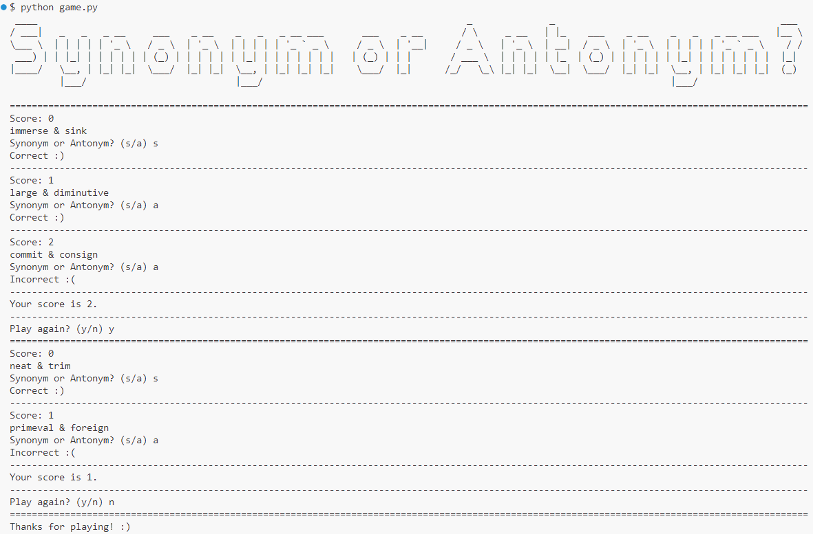

# Synonym or Antonym?

**Synonym or Antonym?** is a simple terminal-based game, where the user guesses whether two words are synonyms or antonyms to each other.

## Instructions

You need Python to play this game.
```console
cd 'FOLDER WHERE GAME WAS INSTALLED'
python game.py
```


## Resources Utilized

The initial data of words and their synonyms and antonyms was provided by the [data/english_synonyms_and_antonyms.csv](https://github.com/SuzanaK/english_synonyms_antonyms_list/blob/master/data/english_synonyms_and_antonyms.csv) file from the [SuzanaK/english_synonyms_antonyms_list](https://github.com/SuzanaK/english_synonyms_antonyms_list/) repository on GitHub.

## Changelog

v1.0.0 (8/31/2021)
- Initial version
- Utilized the [Free Dictionary API](https://dictionaryapi.dev/) and [dwyl/english-words](https://github.com/dwyl/english-words/blob/master/words_alpha.txt)

v2.0.0 (11/3/2024)
- Added requirements.txt
- Added ASCII art at the start of each play
- Changed data source to [SuzanaK/english_synonyms_antonyms_list](https://github.com/SuzanaK/english_synonyms_antonyms_list/)

## License

**Synonym or Antonym?** is licensed under [GNU GPLv3](https://github.com/augene/synonym-or-antonym/blob/main/LICENSE).
